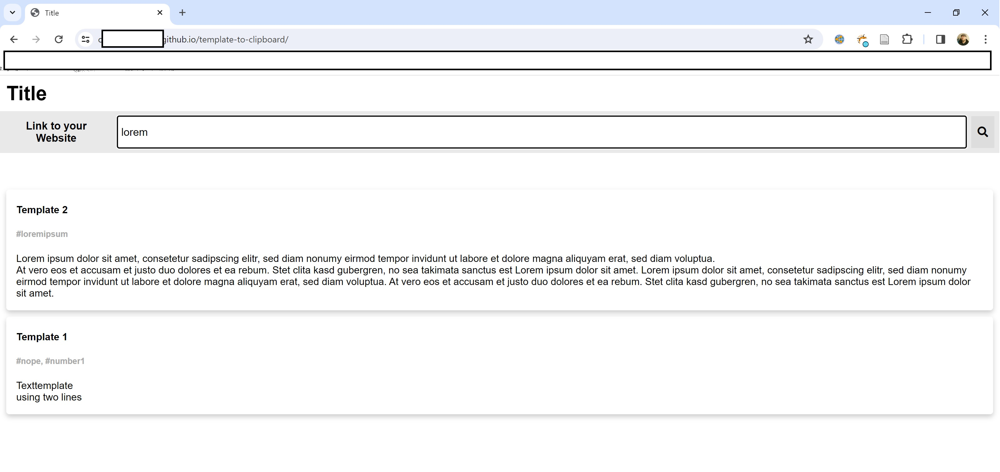

# template-to-clipboard
Creates a website on Github Pages (or selfhosted) for your collection of text templates.

## Setup
1. Create your text template database inside template-db.csv (e.g. using excel) -> Use ```<br>``` for newline in the text column (third column)
2. Compile the csv to a json file using csvDB-to-json.py
3. Upload the folder to github or your favourite webhost
## Usage
Enter some search term into the searchbar. Click on a template card to copy it's text to the clipboard. Done.
